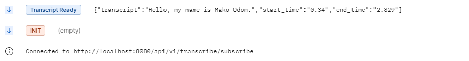

# Speech-to-Text Transcription Service

## Overview
This project is a **Spring Boot application** that transcribes **M4A audio files** using **AWS S3** and **AWS Transcribe**. Since AWS Transcribe is an asynchronous service, the application uses **Spring Boot Scheduling** to periodically check the transcription status and **Server-Sent Events (SSE)** to notify users when the transcript is available.

## Features
✅ Upload audio files (**M4A**) to **Amazon S3**  
✅ Start an **AWS Transcribe** job to process the file  
✅ Use **Spring Boot Scheduling** to poll for the transcription status  
✅ Use **Server-Sent Events (SSE)** to notify users when the transcript is ready  
✅ Retrieve and display the transcript from **S3**

## Architecture
1. **User uploads an M4A file (can be extended to add multiple audio formats)** → Stored in **Amazon S3**
2. **AWS Transcribe processes the file** → Generates a transcript
3. **Spring Boot Scheduler polls AWS Transcribe** → Checks transcription status
4. **Once completed**, transcript is saved in **S3**
5. **Server-Sent Events (SSE) notify users** → Sends real-time updates

## Technologies Used
- **Java 21**
- **Spring Boot**
- **AWS SDK (S3, Transcribe)**
- **Spring Scheduler**
- **Server-Sent Events (SSE)**
- **Maven**

## Setup Instructions
### 1. Prerequisites
- **AWS Account** with S3 and Transcribe enabled
- **Java 21** installed
- **Maven** installed
- **AWS SDK Credentials** configured (`~/.aws/credentials` or environment variables)

### 2. Clone the Repository
```sh
 git clone https://github.com/UmaxCode/springboot-with-aws-transcribe.git
 cd springboot-with-aws-transcribe
```

### 3. Configure AWS Credentials
Set the following environment variables or update `application.properties`:
Always follow The Least Privilege when configuring programmatic access

IAM User with Policy Or use Role
```
{
    "Version": "2012-10-17",
    "Statement": [
        {
            "Effect": "Allow",
            "Action": [
                "s3:GetObject",
                "s3:ListBucket",
                "s3:PutObject"
            ],
            "Resource": [
                "inputBucket",
                "inputBucket/*",
                "outputBucket",
                "outputBucket/*"
            ]
        },
        {
            "Effect": "Allow",
            "Action": [
                "transcribe:StartTranscriptionJob",
                "transcribe:GetTranscriptionJob"
            ],
            "Resource": "transcriptionJobArn or *"
        }
    ]
}
```
```properties
application.aws.region=${AWS_REGION}
application.aws.access-key=${AWS_ACCESS_KEY}
application.aws.secret-key=${AWS_SECRET_KEY}
application.aws.s3-input-bucket-name=${S3_INPUT_BUCKET_NAME}
application.aws.s3-output-bucket-name=${S3_OUTPUT_BUCKET_NAME}
```

### 4. Build and Run the Application
```sh
mvn clean install
mvn spring-boot:run
```

## API Endpoints
| Method | Endpoint | Description |
|--------|---------|-------------|
| `POST` | `/api/v1/transcribe/upload` | Upload an M4A file to S3 |
| `GET` | `/api/v1/transcribe/subscribe` | Subscribe to SSE for real-time updates |

## Important Notes
- This application uses **English (US) - `en-US`** as the transcription language.
- **Pronunciation is critical** for accurate transcription results. Ensure clear speech and minimal background noise for the best accuracy.
- The image below illustrates this: I said **"Hello, my name is Maxwell Odoom"** and got the following result.
  **Pronunciation is critical** for accurate transcription. Listen to this example:  
  🎧 [Click here to play the audio](transcribe.m4a)


- S3 buckets were created using CloudFormation template : Refer to the [resource-deployment.yaml](resource-deployment.yaml)
